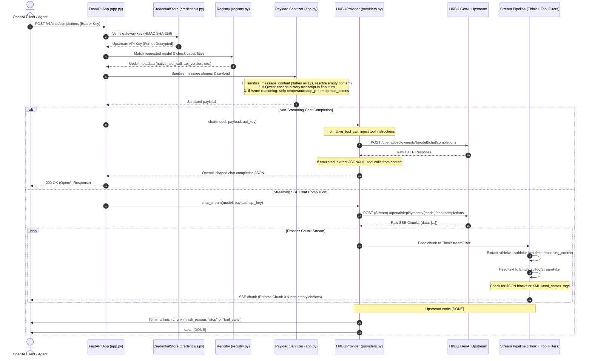

# Architecture Specification

HKBU GenAI Gateway is a lightweight, zero-configuration, OpenAI-compatible proxy and self-service developer portal for the Hong Kong Baptist University (HKBU) GenAI Platform (`https://genai.hkbu.edu.hk/api/v0/rest`).

This document describes the end-to-end system architecture, internal pipelines, upstream adaptation strategies, security model, and streaming invariants.

---

## 1. System Overview & Core Objectives

The gateway bridges standard OpenAI SDKs, desktop clients (VS Code Copilot, Cursor, Cline, Roo Code, LibreChat, Chatbox, Cherry Studio), and AI coding agents to HKBU's centralized GenAI backend.

```
+-----------------------------------------------------------------------------------+
|                            Client Ecosystem                                       |
|  (VS Code Copilot, Cursor, Cline, Roo Code, LibreChat, OpenAI SDKs, Web UI)        |
+-----------------------------------------------------------------------------------+
                                         |
                                         | HTTP / SSE (OpenAI Protocol)
                                         v
+-----------------------------------------------------------------------------------+
|                              HKBU GenAI Gateway                                   |
|                                                                                   |
|  +--------------------+  +---------------------+  +----------------------------+  |
|  |   FastAPI Server   |  |   CredentialStore   |  |       Model Registry       |  |
|  |     (app.py)       |  |  (credentials.py)   |  |        (registry.py)       |  |
|  |                    |  |   Fernet AES-128    |  |  models.dev / WorkBuddy    |  |
|  +--------------------+  +---------------------+  +----------------------------+  |
|            |                                                                      |
|            v                                                                      |
|  +-----------------------------------------------------------------------------+  |
|  | Upstream Compensation & Payload Sanitizer                                   |  |
|  |   - Message sanitization (_sanitize_message_content)                        |  |
|  |   - Qwen dialogue history transcript encoding (_prepare_qwen_messages)      |  |
|  |   - Reasoning parameter stripping (Azure o1/o3/gpt-5)                       |  |
|  |   - Tool schema injection & emulation adapter (tools.py)                    |  |
|  +-----------------------------------------------------------------------------+  |
|            |                                                                      |
|            v                                                                      |
|  +-----------------------------------------------------------------------------+  |
|  | Coordinated Streaming Pipeline (providers.py)                               |  |
|  |   - ThinkStreamFilter (extracts <think> tags into delta.reasoning_content)  |  |
|  |   - EmulatedToolStreamFilter (intercepts JSON/XML tool calls)              |  |
|  |   - Protocol Invariant Engine (Chunk 0 guarantee, finish_reason guarantee)  |  |
|  +-----------------------------------------------------------------------------+  |
+-----------------------------------------------------------------------------------+
                                         |
                                         | HTTP POST / Upstream SSE
                                         | (api-key auth, /openai/deployments/...)
                                         v
+-----------------------------------------------------------------------------------+
|                        HKBU GenAI Upstream Platform                               |
|                     (https://genai.hkbu.edu.hk/api/v0/rest)                       |
|                                                                                   |
|     Azure OpenAI      Google Gemini      Alibaba Cloud      Vertex AI Llama       |
|    (GPT-4.1, o1, o3)  (Flash / Pro)     (Qwen Plus/Max)    (Llama 4 Maverick)     |
+-----------------------------------------------------------------------------------+
```

### Key Design Goals
1. **Zero-Configuration Drop-in**: Run out-of-the-box on macOS, Linux, and Windows without external databases, message brokers, or required environment variables.
2. **Transparent Adaptation**: Shield downstream coding agents from upstream quirks (e.g. Qwen history loss, NestJS class-validator schema rejections, Azure reasoning parameter mismatches).
3. **Universal Tool Calling**: Guarantee full OpenAI `tools` and `tool_calls` support for all models—natively for supported providers, and via prompt emulation for unparsed models.
4. **Strict Protocol Compliance**: Guarantee vital streaming invariants (Chunk 0 `content: ""`, non-empty choices arrays, terminal `finish_reason: "stop"`) to prevent agent IDE crashes.
5. **Zero Leakage**: Never log user prompts, dialogue histories, or upstream credentials to stdout or production logs.

---

## 2. End-to-End Request & Data Flow



---

## 3. Module Boundaries & Responsibilities

The codebase enforces strict single-responsibility boundaries:

| Module | Location | Primary Responsibilities | Strict Boundary Constraints |
| :--- | :--- | :--- | :--- |
| **App Routing** | `src/hkbu_gateway/app.py` | FastAPI application lifecycle, HTTP route declarations, exception handling, content sanitization (`_sanitize_message_content`), Qwen message preparation (`_prepare_qwen_messages`), Azure parameter filtering. | Never execute raw SQL queries. Access credentials solely via `app.state.credentials`. Never log user prompts or tool outputs. |
| **Credentials & Security** | `src/hkbu_gateway/credentials.py` | Encrypted SQLite store (`CredentialStore`), Fernet symmetric encryption at rest, constant-time SHA-256 token verification. | Keys must never be stored in plaintext. Use parameterized SQL (`?`) exclusively. |
| **Model Registry** | `src/hkbu_gateway/registry.py` | Declarative model catalog, capabilities discovery (`native_tool_call`, `supports_tool_call`, `supports_reasoning`, `supports_vision`), context window definitions, OpenRouter & WorkBuddy metadata formatting. | All models must explicitly declare capability flags. |
| **Upstream Provider Client** | `src/hkbu_gateway/providers.py` | HTTPX async client, upstream URL construction, authentication headers (`api-key`), SSE streaming management, `ThinkStreamFilter`, streaming protocol invariants. | Must handle upstream HTTP errors and format them into OpenAI RFC error objects without dropping SSE connections prematurely. |
| **Tool Calling Emulation** | `src/hkbu_gateway/tools.py` | Prompt-based tool schema injection, historical tool call reconstruction, multi-format parsing (Markdown JSON blocks, outermost braces, XML tags `<name>`), `EmulatedToolStreamFilter`. | Injects tool definitions as system instructions, preserves call IDs, and handles `tool_choice: "none"`. |
| **Protocol Schemas** | `src/hkbu_gateway/protocol.py` | Pydantic v2 schemas for OpenAI completion requests, chat responses, delta chunks, usage, and error representations. | Maintain complete compatibility with official OpenAI SDK specifications. |
| **Configuration** | `src/hkbu_gateway/config.py` | Environment variable parsing, default path resolution, dataclass definitions (`Settings`). | Do not hardcode runtime secrets or university keys. |
| **Frontend Portal** | `frontend/src/` | Developer dashboard, 1-click credential generator, interactive chat playground with real-time reasoning accordion and Markdown rendering. | Compiles to `static/` with relative asset links (`base: './'`). |

---

## 4. Upstream Platform Adaptation & Compensations

HKBU's centralized GenAI backend exposes a unified URL space (`/openai/deployments/{model}/...`) backed by multiple underlying cloud vendors (Azure OpenAI, Google Vertex AI, Alibaba Cloud DashScope). This architecture introduces cross-provider quirks that the gateway normalizes transparently:

### 4.1. Shared NestJS DTO vs. Provider Gating
Upstream HKBU API documentation exposes OpenAPI schemas globally containing `tools?: ToolDto[]` for all deployments because the school backend is implemented as a shared NestJS service. However, the downstream cloud adapters for Alibaba Cloud Qwen (`qwen3-max`, `qwen-plus`), Google Vertex AI Llama (`llama-4-maverick`), and DeepSeek reject native tool schemas.
- **Gateway Solution**: The model registry sets `native_tool_call: False` for these models. `tools.py` intercepts incoming client tools, compiles their JSON schemas into a structured system prompt, and strips the native `tools` array from the upstream payload.

### 4.2. Non-Azure (Qwen, DeepSeek, Llama) Multi-Turn History Loss
Live verification on 2026-09-30 and 2026-10-02 revealed that HKBU's custom upstream adapters for non-Azure models (`qwen-plus`, `qwen3-max`, `deepSeek-V4-Pro-hkbu`, `deepseek-v4-flash`, `llama-4-maverick`) forward only the *final user turn*, silently discarding all preceding user and assistant messages:
- **Gateway Solution (`_prepare_history_transcript`)**:
  - Encodes the prior dialogue history as a structured JSON transcript prefixed directly inside the final user message (`Conversation history (oldest to newest): [...] \n\nCurrent user request: ...`).
  - Preserves separate system messages (probes confirmed multiple system messages are received and honored upstream).
  - Remaps `developer` role to `system` (upstream rejects `developer` with HTTP 400).
  - Anchors the active user goal when the preceding turn is a tool result.
  - Single-turn queries bypass encoding with zero overhead.

### 4.3. Message Content Shape Normalization (`_sanitize_message_content`)
Upstream NestJS class-validators enforce strict shape rules on `messages[].content`:
1. Empty strings (`""`) trigger HTTP 400 on all roles.
2. Anthropic-style content part arrays (e.g. `[{"type": "tool_result", ...}]`) trigger HTTP 400 on models expecting string content.
3. Assistant turns with `tool_calls` require `content: null` (None), whereas `content: ""` triggers HTTP 400.
4. Tool role messages reject `null` and `""`.
- **Gateway Solution**:
  - Assistant messages with `tool_calls` have empty content coerced to `None`.
  - Tool/function response turns have empty content defaulted to `"(success)"`.
  - Non-image content part arrays are flattened into unified strings.
  - User/system turns with empty strings receive a single compliant whitespace `" "`.

### 4.4. Azure OpenAI Reasoning Models (`o1`, `o3-mini`, `gpt-5`)
Azure OpenAI reasoning deployments reject sampling hyperparameters and standard token limits:
- Custom `temperature`, `top_p`, `presence_penalty`, and `frequency_penalty` are stripped from the upstream payload.
- `max_tokens` is mapped to `max_completion_tokens`.

### 4.5. Google Gemini Routing
Gemini deployments (`gemini-2.5-flash`, `gemini-2.5-pro`) reject the standard Azure query parameter `?api-version=...` with HTTP 400 (`Invalid api-version`).
- The model registry sets `api_version: None` for Gemini models, causing `providers.py` to omit the query string entirely.

### 4.6. Browser CORS & 3-Tier Web Fetch Proxying (`/api/tools/web_fetch`)
When AI agents attempt to inspect web pages, executing `fetch()` directly in the client browser fails on 99.9% of websites due to browser Same-Origin Policy and lack of `Access-Control-Allow-Origin: *`.
- **Gateway Solution**:
  - **Tier 1 (Server-Side Proxy)**: Added `POST /api/tools/web_fetch` to the FastAPI backend, using `httpx` with desktop User-Agent, automatic redirect following, 15-second timeout, SSRF protection against cloud metadata endpoints (`169.254.169.254`), and automated HTML text stripping (`_clean_html_text`).
  - **Tier 2 (Companion Node)**: Added `POST /api/web_fetch` to `hkbu_genai_companion.py` via Python stdlib `urllib.request`.
  - **Tier 3 (Browser Direct)**: Maintained as final fallback.

---

## 5. Streaming Engine & Protocol Invariants

Coding assistants (VS Code Copilot, Cursor, Cline) are brittle when handling Server-Sent Events (SSE). Minor deviations from the OpenAI streaming contract cause immediate client failure. The gateway enforces three strict invariants in `providers.py` and `tools.py`:

```
Upstream SSE Stream
        |
        v
+-----------------------+
|  Chunk 0 Injector     |  Guarantees: {"delta": {"role": "assistant", "content": ""}}
+-----------------------+
        |
        v
+-----------------------+
|  ThinkStreamFilter    |  Extracts: <think> tags -> delta.reasoning_content
+-----------------------+
        |
        v
+-----------------------+
|  EmulatedToolFilter   |  Intercepts: ```json {...} ``` or <tool_name>...</tool_name>
+-----------------------+
        |
        v
+-----------------------+
|  Terminal Injector    |  Guarantees: finish_reason: "stop" / "tool_calls" before [DONE]
+-----------------------+
        |
        v
Downstream Client SSE
```

### Invariant 1: Initial Assistant Frame (Chunk 0)
Many client parsers (including VS Code Copilot) initialize their string accumulator only when receiving an assistant delta. If the first chunk contains only `role: "assistant"` without `content: ""`, the client fails to initialize and closes the connection.
- **Guarantee**: The gateway ensures that Chunk 0 always includes both `"role": "assistant"` and `"content": ""`:
  ```json
  {"choices": [{"index": 0, "delta": {"role": "assistant", "content": ""}, "finish_reason": null}]}
  ```

### Invariant 2: Choices Array Non-Empty Guarantee
Certain upstream events (usage statistics, transient gateway notices, or error payloads) omit the `choices` array or send `choices: []`. This triggers client crashes with `Response contained no choices`.
- **Guarantee**: Every emitted SSE event is enriched with a compliant choice fallback containing `index: 0` and a non-null delta object.

### Invariant 3: Mandatory Terminal Finish Reason
Streams must never terminate with `data: [DONE]` alone. Clients wait indefinitely or mark the response as aborted if they do not receive an explicit termination frame.
- **Guarantee**: Before emitting `data: [DONE]`, the gateway guarantees the emission of a terminal chunk containing `finish_reason: "stop"` (or `finish_reason: "tool_calls"`).

---

## 6. Tool Calling Emulation Engine (`tools.py`)

For models lacking native function calling (DeepSeek, Qwen, Llama), the gateway acts as an autonomous tool virtualization engine:

### 6.1. Protocol Injection
When a client request provides `tools: [...]`:
1. The tool schemas are converted into a TypeScript-style JSON specification.
2. A system prompt instruction is inserted immediately following the client's system instructions, detailing the invocation contract:
   - When tools are needed, output a markdown fenced JSON block ````json {"name": "...", "arguments": {...}} ````.
   - When tools are not needed, output normal text directly.

### 6.2. Multi-Turn Conversation Reconstruction
When handling subsequent turns in a multi-turn tool interaction:
- Client messages containing `role: "tool"` or `role: "function"` are reconstructed into assistant-digestible dialogue context.
- Historical `tool_call_id` associations are preserved to maintain execution lineage.

### 6.3. Multi-Format Extraction
The extraction parser (`extract_tool_calls`) uses a 4-tier fallback strategy:
1. **Markdown Fenced Code Blocks**: ```` ```(?:json)?\s*([\s\S]*?)\s*``` ````.
2. **Outermost Balanced JSON Objects**: Identifies outer `{` and `}` boundaries and validates against known tool schemas.
3. **Outermost Balanced JSON Arrays**: Identifies batch tool invocations `[{...}, {...}]`.
4. **XML Tag Extraction (`_extract_xml_tool_calls`)**: Parses DeepSeek and Anthropic-style tag calls (e.g. `<read_file><path>...</path></read_file>` or `<tool_call>{"name": ...}</tool_call>`).

### 6.4. Streaming Latch State Machine (`EmulatedToolStreamFilter`)
During streaming completions, the model's output cannot be forwarded immediately if it might be a tool call:
- **Buffering & Detection**: Chunks are held in a preliminary buffer until the output format is determined:
  - If the buffer begins with ```` ``` ````, `{`, `[`, or `<tool_name>`, the filter latches into **Tool Candidate Mode** and continues buffering silently.
  - If the buffer begins with normal conversational text, the filter flushes the buffer and transitions to **Direct Passthrough Mode**.
- **Flushing**: When upstream signals completion, if in Tool Candidate Mode, the buffered payload is parsed. If valid tool calls are extracted, an OpenAI delta with `tool_calls` and `finish_reason: "tool_calls"` is yielded; otherwise, the buffer is emitted as regular message content.

---

## 7. Reasoning Extraction Engine (`ThinkStreamFilter`)

Models such as DeepSeek-R1, Qwen-Max, and Gemini Flash Thinking produce step-by-step reasoning tokens. The gateway supports both native reasoning fields and XML thought blocks:

1. **Native Field Passthrough**: If upstream emits `delta.reasoning_content`, it is forwarded directly to downstream clients.
2. **Tag Parsing**: For models that emit thinking within the standard `delta.content` stream (using `<think>`, `<thought>`, `<thinking>`, or `<reasoning>` tags), `ThinkStreamFilter` performs stateful stream parsing:
   - Tokens between opening and closing tags are extracted and emitted as `delta.reasoning_content`.
   - Conversational tokens outside tags are emitted as standard `delta.content`.
   - Tag boundaries spanning multiple SSE chunks are seamlessly buffered and split.

---

## 8. Security Architecture & Data Protection

The gateway implements a multi-layer zero-leakage security model:

```
[Incoming Request] -> Gateway Key (hkbu-...)
                           |
                           v
                SHA-256 Hash Computation
                           |
                           v
         Constant-Time Comparison (hmac.compare_digest)
                           |
                     (Valid Match)
                           |
                           v
      Retrieve Encrypted Upstream Key from SQLite
                           |
                           v
        Fernet Decrypt (AES-128-CBC + HMAC-SHA256)
                           |
                           v
               In-Memory Upstream Dispatch
                  (api-key: <HKBU_KEY>)
```

1. **At-Rest Encryption**:
   - Upstream HKBU Platform keys are encrypted using Fernet (AES-128 in CBC mode with PKCS7 padding and HMAC-SHA256 authentication).
   - If `HKBU_GATEWAY_ENCRYPTION_KEY` is not provided, a secure Fernet key is generated and stored in `hkbu_gateway.key` with restricted file permissions (`0600`).
2. **One-Way Gateway Key Storage**:
   - Plaintext gateway tokens (`hkbu-...`) are generated via `secrets.token_urlsafe(32)` and returned to the user exactly once.
   - Only the SHA-256 digest of the gateway key is stored in the SQLite database.
   - Verification uses `hmac.compare_digest` to prevent timing attacks.
3. **Memory Isolation**:
   - Decrypted upstream university keys exist only in transient local variable scopes during active HTTP requests.
   - Keys are never persisted in plain files, cache structures, or environment variables.
4. **Zero-Logging Invariant**:
   - Production logs never record upstream API keys, gateway tokens, user prompts, system instructions, or tool result bodies.
   - Exception handlers truncate error payloads to a safe preview length (`[:2000]`) and strip authorization headers.
5. **SQL Injection Prevention**:
   - No raw SQL statements are ever constructed using string formatting. All SQLite interactions use parameterized queries with `?` placeholders via `CredentialStore`.

---

## 9. Deployment & Runtime Lifecycle

The gateway is packaged for immediate deployment across desktop, container, and cloud environments:

- **Local Desktop Scripts**:
  - `start.sh` / `start.command`: Unix launcher with automated Python environment creation. Auto-provisions Python via `uv` if system Python is `<3.9`. Opens the web playground in the default browser.
  - `start.bat`: Windows Explorer launcher with automatic virtual environment initialization.
- **Container Architecture**:
  - Multi-stage `Dockerfile` based on `python:3.12-slim`.
  - `docker-compose.yml` mounts `./data` to `/app/data` to ensure persistent credentials and encryption keys survive container rebuilds.
- **PaaS & Serverless**:
  - Root `Procfile` ready for zero-configuration deployments on Railway and Render (`web: PYTHONPATH=src uvicorn hkbu_gateway.app:app --host 0.0.0.0 --port ${PORT:-8000}`).

---

## 10. Agentic Playground & Client Compute Offloading

Starting in v2.0.0, the gateway includes an autonomous **Agentic Playground** inspired by minimalist harnesses (Pi agent / `pi-agent-core`, OpenClaw, DeepSeek Harness).

### 10.1 Cloud Safety & Railway Resource Isolation

Deploying the gateway to cloud PaaS platforms like Railway introduces two hard constraints:
1. **Resource Limits**: Free and standard tiers provide 512MB–1GB RAM and ephemeral disk storage.
2. **Security & Anti-RCE**: Executing arbitrary Python code, shell commands, or filesystem operations inside a multi-tenant cloud container presents severe remote code execution (RCE) and quota-exhaustion risks.

To achieve absolute server safety and zero operational overhead on Railway, compute is offloaded entirely to the user's client using a **Two-Tier Hybrid Architecture**:

```
                       +---------------------------------------------------+
                       |              Railway Cloud Container              |
                       |       (hkbu-genai-gateway FastAPI Backend)        |
                       | - Stateless OpenAI API Proxy                      |
                       | - Encrypted Credential Vault                      |
                       | - Model Capabilities Discovery                    |
                       | - Tool Calling Emulation (Qwen / DeepSeek)        |
                       +---------------------------------------------------+
                                                ^
                                                | OpenAI REST / SSE Stream
                                                v
+---------------------------------------------------------------------------------------------------------+
|                                        User's Local Machine                                             |
|                                                                                                         |
|  +-------------------------------------------------------------+                                        |
|  |                Web Browser (Playground UI)                  |                                        |
|  |                                                             |                                        |
|  |  +-----------------------+     +--------------------------+ |                                        |
|  |  |  Agent Loop Engine    | <-> |   Tool Registry          | |                                        |
|  |  |  (runAgentLoop)       |     |   (OpenAI Schema Format) | |                                        |
|  |  +-----------------------+     +--------------------------+ |                                        |
|  |              |                              |               |                                        |
|  |              v                              v               |                                        |
|  |  +--------------------------------------------------------+ |                                        |
|  |  |           Tier 1: Browser-Native Sandboxed Tools       | |                                        |
|  |  | - Pyodide (Python 3.12 WebAssembly + NumPy/Pandas)    | |                                        |
|  |  | - Matplotlib Figure Interceptor (inline Base64 PNG)   | |                                        |
|  |  | - Browser File System Access API (showDirectoryPicker) | |                                        |
|  |  | - Web Page Content Extractor & Safe Calculator        | |                                        |
|  |  +--------------------------------------------------------+ |                                        |
|  +-------------------------------------------------------------+                                        |
|                                 |                                                                       |
|                                 | Local Loopback (HTTP/WebSocket)                                       |
|                                 v (http://127.0.0.1:9001)                                               |
|  +-------------------------------------------------------------+                                        |
|  |        Tier 2: Opt-In Local Companion Node (Power Users)    |                                        |
|  |        (companion/hkbu_genai_companion.py)                  |                                        |
|  | - Zero-external-dependency standard library Python daemon   |                                        |
|  | - Strict 127.0.0.1 binding with CORS preflight support      |                                        |
|  | - Host Bash execution & local terminal bridge               |                                        |
|  +-------------------------------------------------------------+                                        |
+---------------------------------------------------------------------------------------------------------+
```

### 10.2 Tier 1: In-Browser Sandboxed Toolsuite (Zero-Install)
Available instantly with zero configuration or local installations:
- **Pyodide CPython 3.12 Wasm Engine**: Runs Python scripts directly inside the browser thread. Automatically captures `sys.stdout` and `sys.stderr`. Detects Matplotlib plot creation and extracts chart figures as inline Base64 PNG images rendered inside collapsible `ToolCallCard` components.
- **Browser File System Access API**: Allows users to select a local folder via the native browser directory picker (`showDirectoryPicker()`). The agent can list directories, read source files, and write output files directly to the selected directory after obtaining browser permission.
- **Web Content Extractor & Calculator**: Fetches web documentation and evaluates mathematical expressions within safe browser sandboxes.

### 10.3 Tier 2: Opt-In Local Companion Node (Power Users)
For tasks requiring host shell commands, Git workflows, or full filesystem access:
- **Zero External Dependencies**: Implemented using Python's standard library (`http.server.ThreadingHTTPServer`, `subprocess`, `urllib`). Requires no `pip install`.
- **Strict Loopback Isolation**: Binds exclusively to `127.0.0.1:9001` (never `0.0.0.0`), preventing any LAN or external network access.
- **Auto-Discovery**: The Playground UI automatically pings `http://127.0.0.1:9001/healthz`. When detected, host terminal tools (`companion_bash_execute`, `companion_read_file`, `companion_write_file`) are dynamically registered in the agent's active tool catalog.

### 10.4 Autonomous Agent Loop Engine
Inspired by the core architecture of Pi-agent (`pi-agent-core`):
1. **Loop State Machine**: Implements iterative reasoning and execution cycles (`runAgentLoop`).
2. **Streaming Protocol Integration**: Streams LLM generation deltas in real-time, accumulating tool call arguments incrementally.
3. **Safety Guards**:
   - **Iteration Cap**: Enforces a strict default limit of 10 loop iterations per prompt to prevent runaway token expenditure.
   - **Cancellation Token**: Live `AbortController` connection allows users to interrupt the agent cycle at any moment.
   - **Output Truncation**: Tool outputs exceeding safe lengths are truncated with informational indicators to protect token budgets.
